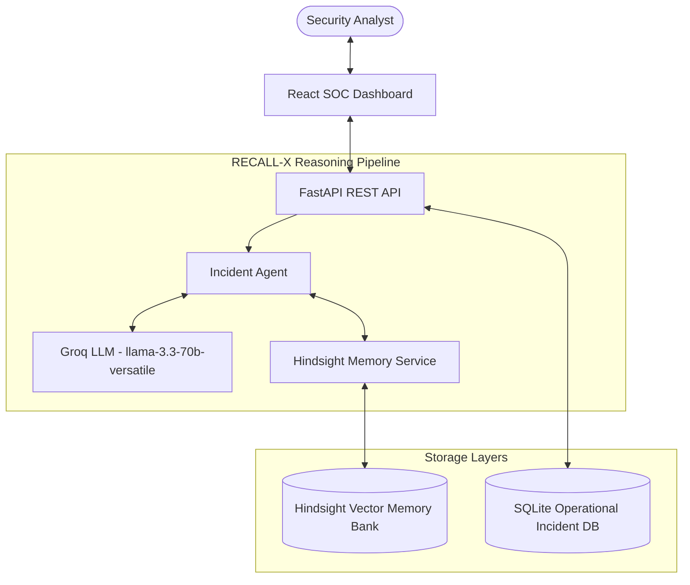

# RECALL-X
> **An AI Incident Response Agent That Learns From Every Incident**

---

## 🚀 Live Demo URLs

* **Frontend Live Application**: [https://nasty-parents-stop.loca.lt](https://nasty-parents-stop.loca.lt)
* **Backend Public API**: [https://short-nails-nail.loca.lt](https://short-nails-nail.loca.lt)
* **GitHub Repository**: [https://github.com/sasidhark23-svg/RECALL-X](https://github.com/sasidhark23-svg/RECALL-X)

---

## 💡 Problem & Solution

### WITHOUT MEMORY:
Traditional AI security assistants treat every incident independently. When an incident is resolved, the root cause analysis, failed containment actions, and successful remediation steps are lost to the AI. Every new incident begins from zero—frequently repeating previous containment mistakes (e.g., relying solely on perimeter IP blocking when attackers use rotated proxies).

### WITH HINDSIGHT:
RECALL-X retains **organizational incident experience** in a long-term memory bank using Hindsight. When a new incident is submitted:
1. RECALL-X queries Hindsight memory for semantically similar past incidents.
2. Recalls past **symptoms**, **root causes**, **failed containment attempts**, and **proven successful remediations**.
3. Feeds these historical memories to the Groq LLM reasoning engine.
4. Generates an **experience-informed response** that explicitly avoids past mistakes.
5. When the analyst marks the incident as resolved, the newly confirmed root cause and lessons learned are retained in Hindsight for future incidents.

---

## 🏗️ Architecture



---

## ⚡ Tech Stack

* **Frontend**: React 18, Vite 5, Tailwind CSS 3, React Router 6, Recharts, Lucide Icons
* **Backend**: Python 3.14, FastAPI 0.141, Uvicorn 0.54, SQLAlchemy, Pydantic v2
* **Database**: SQLite
* **AI Model**: Groq API (`llama-3.3-70b-versatile`)
* **Memory Engine**: `hindsight-client` Python SDK (Hindsight by Vectorize)

---

## 🚀 Local Quick Setup

### 1. Prerequisites
* Python 3.10+
* Node.js 18+ and npm

### 2. Environment Variables Setup
Copy `.env.example` to `.env`:

```bash
cp .env.example .env
```

### 3. Backend Setup
```bash
python -m pip install -r requirements.txt
python seed_demo.py
python -m uvicorn backend.main:app --reload --host 0.0.0.0 --port 8000
```

### 4. Frontend Setup
```bash
cd frontend
npm install
npm run dev
```

Open `http://localhost:3000` in your browser.

---

## 🎯 60-Second Demo Walkthrough

Navigate to the **Demo Mode** page in the UI (`/demo-mode`) and click **RUN 60s DEMO COMPARISON**.

1. **Scenario**: *500 failed login attempts followed by successful login from an unknown IP, then unusual outbound TLS traffic to target-c2.net.*
2. **MEMORY OFF (Generic AI)**: Recommends perimeter IP blocking (a standard playbook action that fails when attackers rotate egress proxies).
3. **MEMORY ON (RECALL-X + Hindsight)**: Recalls historical incident `INC-003`. Identifies that IP-only blocking previously failed, and prioritizes **account disablement, OAuth session revocation, and hardware MFA enforcement**.
